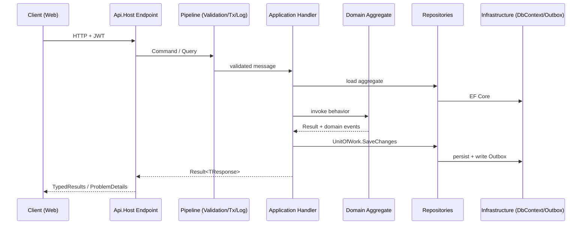

# Architecture Standards

> Mandatory for every generated or migrated solution. Layout lives in [FolderStructureStandards](folder-structure-standards.instructions.md); code rules in [CodingStandards](coding-standards.instructions.md).

Applies to: HRMS, ERP, CRM, School Management, FinTech, multi-tenant SaaS – .NET APIs, Angular and React frontends.

---

## 1. Architectural Style

| Concern | Decision |
|---|---|
| Overall | **Clean Architecture + DDD, modular by feature** inside a single deployable (modular monolith). Extract to services only with an ADR. |
| API style | **ASP.NET Core Minimal APIs** (.NET 10 LTS), REST, versioned (`/api/v1/...`), OpenAPI 3.1 |
| Use-case dispatch | CQRS-lite: commands mutate via aggregates, queries read via projections |
| Persistence | **Hybrid Repository**: EF Core 10 for commands, EF no-tracking projections or Dapper for reads/reports |
| Errors | `Result<T>` for expected failures; exceptions only for truly exceptional cases; ProblemDetails (RFC 9457) on the wire |
| Consistency | One aggregate per transaction; cross-aggregate via domain events + transactional **Outbox** |
| Security | Zero-trust, OIDC/JWT, permission-based authorization, tenant isolation at query-filter level |
| Observability | OpenTelemetry traces/metrics/logs, Serilog structured logs, correlation id on every request |
| Frontend | Angular (latest stable, standalone, signals, zoneless) **or** React 19 + Vite + TanStack; one SPA under `src/Web/` |

## 2. Layer Responsibilities

| Layer | Owns | Must NOT |
|---|---|---|
| `Api.Host` | HTTP surface, auth wiring, OpenAPI, middleware, DI composition | contain business rules, touch `DbContext` |
| `Api.Application` | Use cases, orchestration, validation, authorization checks per use case, mapping to DTOs | reference EF Core/Dapper/HttpContext |
| `Api.Domain` | Invariants, state transitions, domain events, domain services | reference anything but `Shared.Kernels`; do I/O |
| `Api.Abstractions` | Ports (interfaces) consumed by Application | contain implementations |
| `Api.Repositories` | Aggregate persistence + read models | contain business rules, return `IQueryable` |
| `Api.Infrastructure` | DbContext, external systems, security, caching, messaging, jobs | be referenced by Application/Domain |
| `Shared.Kernels` | DDD primitives, `Result`, `Error`, guards | contain feature types |
| `Shared.Dtos` | Wire contracts | contain logic or attributes from EF |
| `Shared.Utilities` | Stateless helpers | hold state or business rules |

## 3. Request Flow

## 4. DDD Rules

- Aggregates expose behavior methods (`employee.Promote(...)`), never public setters.
- Construction through static factories returning `Result<T>`; invariants enforced inside the aggregate.
- Strongly typed ids (`readonly record struct EmployeeId(Guid Value)`), UUID v7 (`Guid.CreateVersion7()`).
- Value objects are immutable records with validation in the factory.
- Reference other aggregates **by id only**.
- Domain events raised inside aggregates, dispatched after commit via Outbox.
- Ubiquitous language: type/method names match business vocabulary captured in `docs/domain/glossary.md`.

## 5. Hybrid Repository Rules

- One command repository per **aggregate root** (not per table).
- Query repositories per **feature**, returning `Shared.Dtos` projections / `PagedResponse<T>`.
- Generic base is `internal` and never injected directly.
- Specifications encapsulate reusable filters; no raw `Expression` parameters on public repository APIs.
- `IUnitOfWork.SaveChangesAsync` is called only by the transaction behavior or the handler – never inside repositories.
- Dapper only for read models, reports, bulk ops, and legacy SP bridges – always parameterized.

## 6. Multi-Tenancy

- Strategy selected per product and recorded as an ADR: shared DB + `TenantId` column (default), schema-per-tenant, or DB-per-tenant.
- `ITenantEntity` + EF global query filter + `TenantStampInterceptor`; Dapper queries MUST include `TenantId` parameter.
- Tenant resolved once (claim → header → host) in middleware; exposed via `ICurrentTenant`.
- Cross-tenant access is a **Critical** defect; covered by integration tests.

## 7. Cross-Cutting Standards

| Concern | Standard |
|---|---|
| Validation | FluentValidation in pipeline; domain invariants in aggregates |
| Mapping | Mapperly (source-generated) or explicit mappings – no runtime reflection mappers |
| Mediator | In-house `ICommandHandler`/`IQueryHandler` or source-generated `Mediator` (MIT). Commercially licensed libs (MediatR ≥ 13, AutoMapper ≥ 15, FluentAssertions ≥ 8) require explicit approval |
| Caching | `HybridCache` (L1 + Redis L2), tag-based invalidation from domain events |
| Resilience | `Microsoft.Extensions.Http.Resilience` standard pipeline for all outbound HTTP |
| Time | Inject `TimeProvider`; never `DateTime.Now` |
| Config | Options pattern + `ValidateOnStart()`; secrets from Key Vault/user-secrets, never in repo |
| Versioning | `Asp.Versioning.Http`; breaking changes → new version |
| Idempotency | `Idempotency-Key` header on POST for payment/approval flows |
| Auditing | `IAuditable` (CreatedBy/At, ModifiedBy/At) via interceptor; audit log table for sensitive entities |
| Soft delete | `ISoftDeletable` + global filter; hard delete only by retention job |

## 8. Architecture Fitness Functions (must pass in CI)

Implemented in `tests/
.Api.ArchitectureTests` using NetArchTest.Rules or ArchUnitNET:

1. Project reference matrix from FolderStructureStandards §2.
2. Domain has no dependency on `Microsoft.EntityFrameworkCore`, `Microsoft.AspNetCore`, `Dapper`.
3. Application has no dependency on `Microsoft.EntityFrameworkCore`, `Dapper`, `*.Infrastructure`, `*.Repositories`.
4. All handlers are `internal sealed`; all DTOs are `sealed record`.
5. Domain entities have no public setters.
6. Classes ending in `Repository` live in `*.Api.Repositories`.
7. No type in `*.Api.Host` other than endpoint/wiring types.

## 9. Architecture Decision Records

Every non-default decision (tenancy model, messaging broker, extracting a service, choosing Dapper for a feature, frontend framework) → `docs/adr/NNNN-title.md` using MADR format: Context, Decision, Consequences, Alternatives.

## 10. Severity Model (used by all review agents)

| Severity | Meaning | Examples |
|---|---|---|
| **Critical** | Security breach, data loss, tenant leak, build broken | SQL injection, missing auth, cross-tenant read |
| **High** | Architecture violation, correctness bug | Application → EF Core, business logic in endpoint |
| **Medium** | Maintainability/performance risk | N+1 query, missing index, anemic aggregate |
| **Low** | Style / naming / docs | naming drift, missing XML doc on public API |
